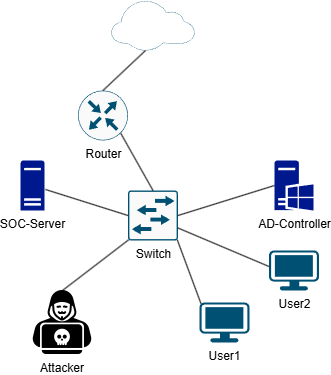
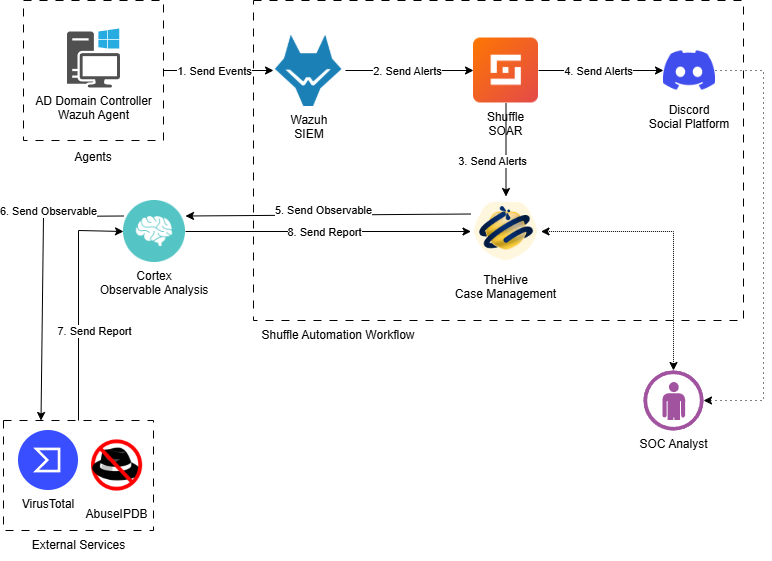

# SOC Prototype Project using Open-Source Tools

## Objective
The topic of my bachelor's thesis was "**Prototype Project of a SOC Using Open-Source Solutions Wazuh, Shuffle, Cortex, TheHive**" My main aim was to investigate process of creating a SOC team, develop a security event monitoring subsystem based on free open-source solutions, which can become the basis for SOCs in small and medium-sized enterprises.

## Tools Used
**Wazuh**: Open-source security monitoring for event analysis and compliance management.  
**Shuffle**: Orchestration platform for automating security tool workflows.  
**TheHive**: Scalable, open-source security incident response platform.  
**Cortex**: Open source and free software for observables analysis.  
**Oracle VM VirtualBox**: Open-source virtualization software that allows users to run multiple operating system on a single device.  
**Windows Server 2019**: Enterprise-grade operating system used to deploy Active Directory Domain.  
**Ubuntu Desktop 24.04**: A free and open-source Linux-based operating system used to run all necessary SOC tools.  
**Discord Bot**: A programmable automation tool integrated into the Discord platform to perform tasks such as sending alerts, executing commands, or collecting data in real time.  
**VirusTotal**: An online service that analyzes files and URLs for viruses, worms, trojans, and other kinds of malicious content using multiple antivirus engines.  
**AbuseIPDB**: A collaborative platform for reporting and checking IP addresses involved in abusive activities such as hacking attempts, brute-force attacks, and spam.  

## Steps
**Deployed the infrastructure** using VirtualBox with dedicated virtual machines for each SOC component, including Ubuntu Server, a domain controller, an attacker machine, and a centralized monitoring system.
**Installed and configured core SOC tools**:
- Wazuh Central Components as SIEM for real-time monitoring of system, parsing, indication and visualization of logs. Added Wazuh agents and webhooks to Shuffle to send alerts.
- TheHive for incident case management where created users can quickly react to incidents, share tasks between each other, make reports.
- Cortex for automated artifact analysis based on downloaded and configured analyzers like VirusTotal, AbuseIPDB.
- Shuffle as SOAR platform for security workflow automation, enhancing the SOC's operational efficiency.  
**Developed custom detection rules in Wazuh** for for common attack patterns such as brute-force login attempts, suspicious PowerShell usage, and malicious files.  
**Built automated workflows in Shuffle** to handle alerts: creating TheHive alerts and cases, enriching with artifacts, sending them to Cortex for analysis, and processing the results.  
**Integrated TheHive and Cortex** via API, enabling seamless interaction between incident management and artifact analysis.  
**Connected a Discord bot** to deliver real-time notifications to the SOC analyst regarding new incidents.  
**Simulated real-world attack scenarios**:
- RDP brute-force attack
- Reverse Shell run with PowerShell
- Adding malicious files to system

## Network Topology

## Architecture-Diagram

