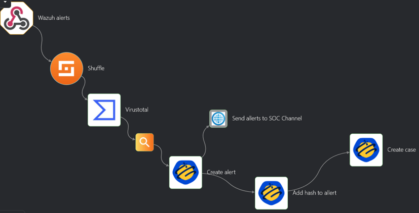

# FIM (File Integrity Monitoring) Detection

## Objective
Demonstration of the system's ability to detect the addition of files to a specific folder.

## Course of attack
The file eicar.txt is added to the Downloads folder on the AD Controller. Eicar.txt is a test file that poses no threat, but is perceived by some antivirus programs as malicious.  

## Response
- Wazuh gets notification in File Integrity Monitoring category and uses configured Webhook to send alert to the Shuffle.
- After receiving a notification in Shuffle, the configured response scenario is automatically launched:
  - Check hash of a file with VirusTotal
  - Continue workflow if value of “Malicious” is not equal to 0.
  - Creating alert in TheHive
  - Adding hash of file as observable to allert
  - Creating case with observable in TheHive
  - Sending notification to Discord Bot

## Shuffle Workflow

