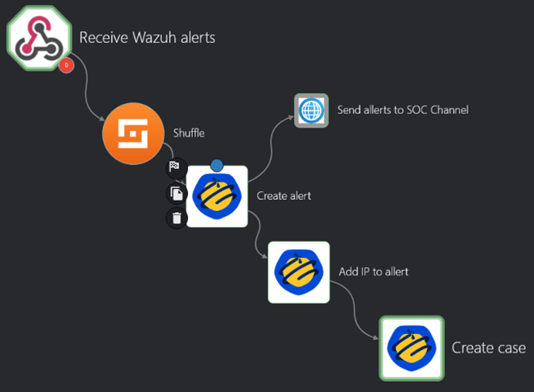

# RDP brute-force attack

## Objective
Verification of the system's ability to detect unauthorized attempts to log in via RDP to a Windows machine.

## Course of attack
Hydra with Kali was used to brute force the password on 3389/tcp.  
**Tool**: hydra  
**Command**: `hydra -l Administrator -P hydra_passwords.txt rdp://192.168.69.10 -t 2`  

## Response
- Wazuh Agent detected login errors in Windows event logs (windows, authentication_failed) and sent a custom rule “Brute-force RDP detected” to Wazuh.  
- Wazuh uses configured Webhook to send alert to the Shuffle.  
- After receiving a notification in Shuffle, the configured response scenario is automatically launched:  
  - Creating alert in TheHive
  - Adding IP of attacker as observable to allert
  - Creating case with observable in TheHive
  - Sending notification to Discord Bot
- In TheHive, IP can be sent to check it with AbuseIPDB or VirusTotal

## Shuffle Workflow

